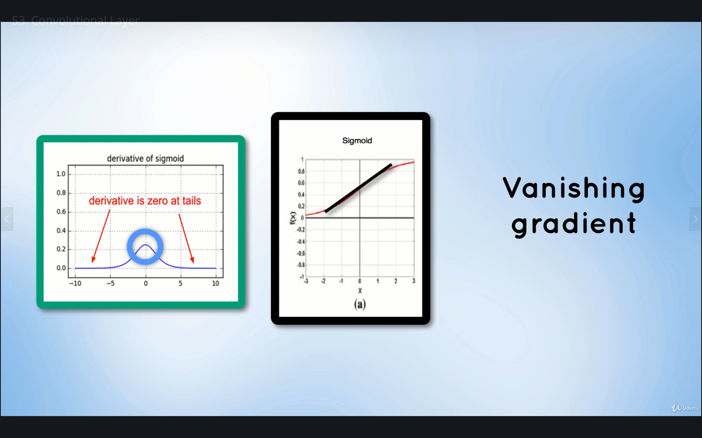

# Convolutional Neural Networks

## Contents

* [Overview](#Overview)
* [Architecture](#architecture)
    * [Convolutional Layer](#convolutional-layer)
    * [ReLU](#relu)
    * [Pooling Layer](#pooling-layer)
    * [... and repeat](#and-repeat)
    * [Fully-Connected Layer](#fully-connected-layer)
* [Known CNNs](#known-cnns)

## Overview

From the lesson on [Image Recognition](../src/ImageRecognition.ipynb) where a neural network was trained to classify handwritten digits (MNIST dataset), it was noticed that the prediction accuracy plateaued at a certain point, and training it even further would result in [Overfitting](./ImageRecognition.md#Overfitting). Therefore, a different approach for image classification is needed to achieve better accuracy, namely the **Convolutional Neural Network**.

**Convolutional Neural Networks** are very effective at recognizing useful pattern within images because they understand that the spatial structures of the inputs are relevant. They use these spatial structures to process the data. They also require fewer parameters as compared to regular, artificial neural networks.

<i>Source: [PyTorch for Deep Learning and Computer Vision - Section 8: Convolutional Neural Networks](https://github.com/rslim087a/PyTorch-for-Deep-Learning-and-Computer-Vision-Course-All-Codes-)</i>

The network still has an **input layer** which accepts the input images, a **fully-connected layer** which is the same multi-layered perceptron parameterized by weights and biases, and then an **output layer** which provides probability values for each output class. The **output layer** is produced by the **Softmax** activation function, and the classification depends on the class with the highest probability.

**Convolutional Neural Network** are known to process data that has a **known, grid-like topology**, and are used in pattern-recognition tasks.

<i>Source: [PyTorch for Deep Learning and Computer Vision - Section 8: Convolutional Neural Networks](https://github.com/rslim087a/PyTorch-for-Deep-Learning-and-Computer-Vision-Course-All-Codes-)</i>

The reason why the non-convolutional network in the [Image Recognition](../src/ImageRecognition.ipynb) lesson somehow worked, is because the MNIST dataset provides *relatively* simple images: it was small (28x28=784 pixels) and it only had 1 channel (grayscale, 1 pixel only had 1 intensity value). The same network would not be able to handle the computational complexity of dealing with more complicated inputs: larger-sized images (ex. 72x72=5184 pixels, which is 7-8x more pixels) and colored images (3 channels, 1 for each color space, so each pixel would now have 3 intensity values).

<i>Source: [PyTorch for Deep Learning and Computer Vision - Section 8: Convolutional Neural Networks](https://github.com/rslim087a/PyTorch-for-Deep-Learning-and-Computer-Vision-Course-All-Codes-)</i>

In the above example, each node would need to process ~15,000 weights, and then that node would be connected to the nodes of the next layer which would also need to process ~15,000 weights, and so on. The more hidden layers, the more computations. Due to the sheer size of the resulting network, there will not be enough computational power to train and run the network. And that's where a **Convolutional Neural Network** comes into play: it makes the computations more manageable.

Another problem solved by **Convolutional Neural Networks** is [Overfitting](./ImageRecognition.md#Overfitting), where the network has memorized the input-output combinations, rather than finding a general pattern that can also apply to inputs not part of the training set. Overfitting is prevented by using **Pooling Layer**.

<i>Source: [PyTorch for Deep Learning and Computer Vision - Section 8: Convolutional Neural Networks](https://github.com/rslim087a/PyTorch-for-Deep-Learning-and-Computer-Vision-Course-All-Codes-)</i>

## Architecture

<i>Source: [PyTorch for Deep Learning and Computer Vision - Section 8: Convolutional Neural Networks](https://github.com/rslim087a/PyTorch-for-Deep-Learning-and-Computer-Vision-Course-All-Codes-)</i>

A **Convolutional Neural Network** (or **CNN**) is comprised of 3 types of layers:

* The **convolutional** layers
* The **pooling** layers
* The **fully-connected** layers

There is still an **input** layer that accepts the input data, and an **output layer** that stores the predictions (probabilities that the input belongs to one of the output classes). The final predictions are calculated using the **Softmax** activation function.

### Convolutional Layer

The main building blocks of this layer are the convolutions, which aim to extract specific features that can be used to classify the image.

<i>Source: [PyTorch for Deep Learning and Computer Vision - Section 8: Convolutional Neural Networks](https://github.com/rslim087a/PyTorch-for-Deep-Learning-and-Computer-Vision-Course-All-Codes-)</i>

Convolutions work by taking a **kernel matrix**, which is typically small in dimension (in this example, it is 3x3), and then "slides" it over all the pixels of the input image. The movement is controlled by the **stride**, which is the number of pixels over which to "slide" the **kernel matrix** over the input (in this example, it is 1). The smaller the **stride**, the smaller the corresponding **feature map**.

<i>Source: [PyTorch for Deep Learning and Computer Vision - Section 8: Convolutional Neural Networks](https://github.com/rslim087a/PyTorch-for-Deep-Learning-and-Computer-Vision-Course-All-Codes-)</i>

The area over which the **kernel matrix** is applied is known as the **receptive field**. Inside this **receptive field**, each cell is multiplied by the corresponding cell in the **kernel matrix**.

<i>Source: [PyTorch for Deep Learning and Computer Vision - Section 8: Convolutional Neural Networks](https://github.com/rslim087a/PyTorch-for-Deep-Learning-and-Computer-Vision-Course-All-Codes-)</i>

Then, the resulting products are then added up (`-55`), and then divided by the number of the cells in the receptive field (`-6.1`). This now becomes part of the **feature map**.

<i>Source: [PyTorch for Deep Learning and Computer Vision - Section 8: Convolutional Neural Networks](https://github.com/rslim087a/PyTorch-for-Deep-Learning-and-Computer-Vision-Course-All-Codes-)</i>

We then move the kernel by a stride of 1 over the next receptive field. We keep doing this until we've convolved the kernel over the entire input, to get the resulting feature map.

<i>Source: [PyTorch for Deep Learning and Computer Vision - Section 8: Convolutional Neural Networks](https://github.com/rslim087a/PyTorch-for-Deep-Learning-and-Computer-Vision-Course-All-Codes-)</i>

Why is it called a **feature map**? The purpose is to decompose the input into a set of features, and in this example, the feature map shows that this part of the input has an "edge": an area with low intensity (`-6.1`) and an area with high intensity (`-45.5`). The **kernel matrix** can then be thought of as a "feature detector", and in this example, the kernel used was designed to look for "edges" from the input image. The kernels can also detect "edges", "curves", "ridges", and other features that can uniquely distinguish one image from another.

Each kernel is designed to have a distinct set of weights, depending on the target feature it needs to extract.

<i>Source: [PyTorch for Deep Learning and Computer Vision - Section 8: Convolutional Neural Networks](https://github.com/rslim087a/PyTorch-for-Deep-Learning-and-Computer-Vision-Course-All-Codes-)</i>

The values of the weights in the kernels are learned by the **CNN** during training, using a gradient descent function that minimizes the errors in detecting features from the input image.

A characteristic of convolution is **translational invariance**, which means it is able that if it can detect features in one part of the image, if the kernel is convolved onto the entire image, then it is likely to detect features in *another* part of the image. For example, a kernel designed to detect diagonal lines would be able to detect that feature from both the top-left and the bottom-right portions of this sample image.

<i>Source: [PyTorch for Deep Learning and Computer Vision - Section 8: Convolutional Neural Networks](https://github.com/rslim087a/PyTorch-for-Deep-Learning-and-Computer-Vision-Course-All-Codes-)</i>

This allows creation of "feature detectors" or "feature filters" that can detect features no matter where the feature is in the image. Different filters detect different features, and the more filters we have, the more features we can extract from the image.

<i>Source: [PyTorch for Deep Learning and Computer Vision - Section 8: Convolutional Neural Networks](https://github.com/rslim087a/PyTorch-for-Deep-Learning-and-Computer-Vision-Course-All-Codes-)</i>

For example, for an input pattern `X`, we can have 3 filters: 1 for the forward slash feature, 1 for the backward slash feature, and 1 for the X feature at the intersection. Convolving these 3 filters onto the image results in 3 feature maps. Each feature map indicates if the corresponding feature appears in the image and its location if it does (indicated by most positive values in the feature map). Then after applying an activation function (the [**ReLU** function](#relu)), it becomes more evident or more distinct if the feature is present in the input (the negative values become zero, so the more positive values become more emphasized).

The number of kernels/filters is known as the depth of the feature map. For example, 15 filters produces a feature map with a depth of 15, which means 15 features. Having more features ultimately leads to better classifications for new images.

The sample convolution shown above is 2D, since the input only has 1 channel (3x3x1). For color images which have 3 channels (RGB), then the kernels would also have to have 3 channels as well (3x3x3), making it a 3D convolution. **The depth of the kernel must match the depth of the input image**.

<i>Source: [PyTorch for Deep Learning and Computer Vision - Section 8: Convolutional Neural Networks](https://github.com/rslim087a/PyTorch-for-Deep-Learning-and-Computer-Vision-Course-All-Codes-)</i>

We mentioned that **CNN**'s make the computations more manageable. This is done by having each node in the **fully-connected layer** only needing to process a small portion of the input, as defined by the kernel size. For example, if we have a 3x3x3 filter, then each node would only need to process 27 weights at a time, which is far more manageable than ~15,000 if we used a regular, artificial neural network.

<i>Source: [PyTorch for Deep Learning and Computer Vision - Section 8: Convolutional Neural Networks](https://github.com/rslim087a/PyTorch-for-Deep-Learning-and-Computer-Vision-Course-All-Codes-)</i>

### ReLU

After obtaining the feature map, the next step is to apply a non-linear function, the **ReLU** activation function. The main reason for doing this is that real-world data that the network has to learn is non-linear, so the neural network must also contain non-linearity. But the convolution operation is basically a combination of matrix multiplication and addition, which is a linear operation, resulting in a linear feature map. So the **ReLU** activation function is applied to make it non-linear.

<i>Source: [PyTorch for Deep Learning and Computer Vision - Section 8: Convolutional Neural Networks](https://github.com/rslim087a/PyTorch-for-Deep-Learning-and-Computer-Vision-Course-All-Codes-)</i>

Other activation functions can be used, namely **Sigmoid** and **Tanh**, but **ReLU** empirically performs better in most situations. The **ReLU** function is inspired by biology, by actual neurons that only have zero and positive states (as opposed to **Sigmoids** positive and negative states). Neurons are "off" when not activated, and have a positive action potential when "on".

<i>Source: [PyTorch for Deep Learning and Computer Vision - Section 8: Convolutional Neural Networks](https://github.com/rslim087a/PyTorch-for-Deep-Learning-and-Computer-Vision-Course-All-Codes-)</i>

Another reason for using **ReLU** instead of **Sigmoid** is to solve the **Vanishing Gradient** problem.

<i>Source: [PyTorch for Deep Learning and Computer Vision - Section 8: Convolutional Neural Networks](https://github.com/rslim087a/PyTorch-for-Deep-Learning-and-Computer-Vision-Course-All-Codes-)</i>

The derivative(gradient) of a **Sigmoid** function is shown on the left. The maximum gradient is only 0.25, and then it becomes zero as it goes toward negative and positive infinity. There is a steep gradient at the middle (good for training), zero gradient at the tails (bad for training), and the overall gradient is limited by these two limits. Since in the [gradient descent algorithm](./LinearRegression.md#gradient-descent), the gradient is re-applied iteratively to the network on each training pass/epoch, it tends to become smaller and smaller because multiplying small decimals together during computations creates even smaller decimals. The gradient then becomes too small ("vanishes"), to the point that the network learning becomes very slow.

This is fixed by using **ReLU**.

<i>Source: [PyTorch for Deep Learning and Computer Vision - Section 8: Convolutional Neural Networks](https://github.com/rslim087a/PyTorch-for-Deep-Learning-and-Computer-Vision-Course-All-Codes-)</i>

If the input is negative, the output is zero. If the input is positive, the output is the same value. The key thing to notice is that the gradient of the function is either 0 or 1, and in the case of a gradient of 1, iteratively multiplying 1 in computations does not cause the gradient value to decrease. Hence, the **Vanishing Gradient** problem will never occur.

### Pooling Layer

<i>Source: [PyTorch for Deep Learning and Computer Vision - Section 8: Convolutional Neural Networks](https://github.com/rslim087a/PyTorch-for-Deep-Learning-and-Computer-Vision-Course-All-Codes-)</i>

The **Pooling Layer** shrinks the feature map stack by reducing the dimensionality of the representation of the feature maps, thereby also reducing the computational complexity for the next layers of the model. It retains only the most important representations of a feature such that each feature of interest is still evident from its feature map.

There are different pooling functions such as sum, average, and max.

The **max** pooling function uses a kernel and slides it onto the entire feature map. For each neighborhood the kernel is applied to, it takes only the maximum value of that neighborhood.

<i>Source: [PyTorch for Deep Learning and Computer Vision - Section 8: Convolutional Neural Networks](https://github.com/rslim087a/PyTorch-for-Deep-Learning-and-Computer-Vision-Course-All-Codes-)</i>

The resulting matrices are basically scaled-down versions of the feature map (almost half the size), accounting only the maximum values, but *still* retaining the feature of interest represented in the original feature map. This scaling down reduces the computational cost (smaller-sized matrices), reduces the number of parameters, and reduces chances of overfitting because it produces an abstracted form of the original feature map.

<i>Source: [PyTorch for Deep Learning and Computer Vision - Section 8: Convolutional Neural Networks](https://github.com/rslim087a/PyTorch-for-Deep-Learning-and-Computer-Vision-Course-All-Codes-)</i>

The maximum value being taken into account should correspond to the region of the image where the feature is most prevalent. It produces **scale invariant** feature maps, such that the feature is still evident even when the size of the image has been scaled-down. Even with small translations in the input image or some distortions, since we are taking the maximum value of each neighborhood, the resulting scaled-down versions would still be the same (ex. `[0.33, 0, 0.11, 0]` would yield the same result as `[0, 0.34, 0, 0.09]` where the values have shifted and are slightly different). This helps in generalizing the features for different input images.

Considering the destructive nature of max pooling operations, the kernel size should be kept small.

### ... and Repeat

The output from the pooling layer can then pass through another set of [Convolutional](#convolutional-layer)-[ReLU](#relu)-[Pooling](#pooling-layer) combination, to extract more features from the previous feature map.

<i>Source: [PyTorch for Deep Learning and Computer Vision - Section 8: Convolutional Neural Networks](https://github.com/rslim087a/PyTorch-for-Deep-Learning-and-Computer-Vision-Course-All-Codes-)</i>

The deeper the network, the more filters are built on top of each other, and the more complex patterns can be encoded.

<i>Source: [PyTorch for Deep Learning and Computer Vision - Section 8: Convolutional Neural Networks](https://github.com/rslim087a/PyTorch-for-Deep-Learning-and-Computer-Vision-Course-All-Codes-)</i>

Note that as more filters produce more feature maps, the resulting image also becomes more unrecognizable. This is expected, as each feature map contains less the information about the entire image itself, but more of the information that can distinguish individual features and the class to which the image belongs to. At the beginning, we encode basic, low-level features like edges, curvatures, and shapes, but as we go deeper, the feature map encodes more sophisticated, higher-level features, like a cat's ears or nose or one of its eyes.

<i>Source: [PyTorch for Deep Learning and Computer Vision - Section 8: Convolutional Neural Networks](https://github.com/rslim087a/PyTorch-for-Deep-Learning-and-Computer-Vision-Course-All-Codes-)</i>

The higher-level features is what allows the neural network to distinguish an image to be belonging to a particular class. It is reasonably expected that they are unrecognizable to the human eye, because of course it is the computer that needs to "see" the pattern, not us. It is actually more helpful to look at the kernels used to create the feature maps, rather than the resulting images themselves.

It is analogous to how us humans learn. At a young age, we learn simple concepts (ex. the alphabet). Then as we grow, we build on this simple concepts and learn more sophisticated ones (ex. sentences, paragraphs, stories, novels, etc.). This is the same with the neural network, where the initial filters only detect simple features, then become more complicated, building upon the earlier simpler features, as it goes through the network.

<i>Source: [PyTorch for Deep Learning and Computer Vision - Section 8: Convolutional Neural Networks](https://github.com/rslim087a/PyTorch-for-Deep-Learning-and-Computer-Vision-Course-All-Codes-)</i>

### Fully Connected Layer

The purpose of the [Convolutional](#convolutional-layer)-[ReLU](#relu)-[Pooling](#pooling-layer) combinations is feature detection/extraction and data representation. Once we've got the feature maps extracted and encoded, the **Fully Connected Layer** (**FCN**) is where the actual classification computations take place.

<i>Source: [PyTorch for Deep Learning and Computer Vision - Section 8: Convolutional Neural Networks](https://github.com/rslim087a/PyTorch-for-Deep-Learning-and-Computer-Vision-Course-All-Codes-)</i>

The **FCN** takes a flattend feature map, feedforwards it through a classifier, then outputs a probability value for each class, thereby predicting to which class the image belongs to. This process essentially follows multi-layered perceptron network used in the [Deep Neural Network](./DeepNeuralNetworks.md) and [Image Recognition](./ImageRecognition.md) models described in previous lessons. Every node in the previous layer is connected to every node in the succeeding layer. Each neuron is connected to all the neurons in the previous layer and each connection has its own weight.

The training follows the same way: the network iteratively updates its weights and biases using a gradient descent algorithm.

1. Random values are first assigned to all the filters in the **Convolutional Layers**
1. Random values are also assigned to the weights and biases of the **FCN**
1. Network receives a training input
1. Features are extracted by convolution and scaled-down by pooling
1. Features are classified in the **FCN**
1. Network outputs a prediction and is compared to the training label
1. The error between actual and expected is calculated (cross entropy)
1. The error is backpropagated through the network to update the convolutional filters and **FCN** parameters
1. Repeat

Note that we still use gradient descent to optimize the network to minimize the error. The values of the filter matrices in the **Convolutional Layers** and the connection weights in the **FCN** are the *only* values that change during training. The number of filters, the kernel size, the number of convolutional-pooling layers, and the number of hidden layers in the **FCN** don't change during training. These are parameters that need to be specified before training.

Note also that the process is essentially similar to how we train regular [Deep Neural Networks](./DeepNeuralNetworks.md) and multi-class [Image Recognition](./ImageRecognition.md) models.

## Known CNNs

* LeNet ([[1]](https://engmrk.com/lenet-5-a-classic-cnn-architecture/))
* AlexNet ([[1]](https://towardsdatascience.com/alexnet-the-architecture-that-challenged-cnns-e406d5297951))
* GoogleNet ([[1]](https://medium.com/coinmonks/paper-review-of-googlenet-inception-v1-winner-of-ilsvlc-2014-image-classification-c2b3565a64e7))
* ResNet ([[1]](https://towardsdatascience.com/an-overview-of-resnet-and-its-variants-5281e2f56035))
