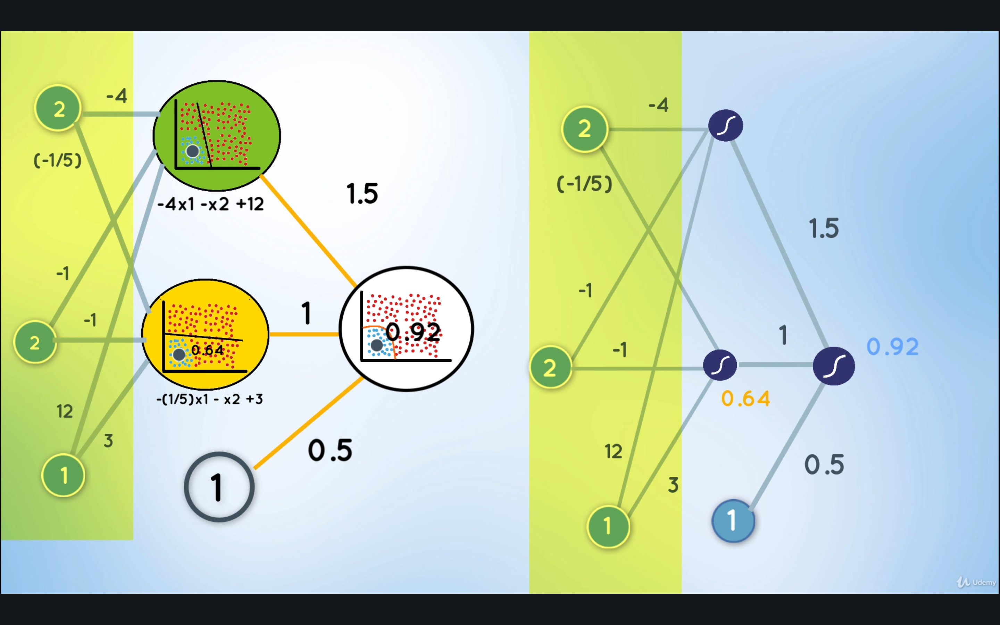

# Deep Neural Networks

## Contents

* [Non-Linear Boundaries](#non-linear-boundaries)
* [Architecture](#architecture)
* [Feedforward](#feedforward)
* [Error Function](#error-function)
* [Backpropagation](#backpropagation)

All images sourced from [PyTorch for Deep Learning and Computer Vision (Section 6: Deep Neural Networks)](https://www.udemy.com/course/pytorch-for-deep-learning-and-computer-vision/).

## Non-Linear Boundaries

When linear models are unable to represent the data, a **non-linear model** is used instead.

We can obtain a **non-linear model** by combining multiple linear models:

From the [Perceptron](./Perceptron.md) lecture, it was established that a linear model is characterized by a weight (`w`) and a bias (`b`) parameter. Then, the output is passed through a **Sigmoid** activation function to convert the output to a probability.

The resulting combination of the linear models results in a **non-linear model**:

The inputs with the larger weight, would be the input that would have the large effect on the resulting model, pretty much dictating what the resulting model would look like.

For example, if `w1=1.5` and `w2=1`, the result looks a lot like the 1st linear model.

But with `w1=1.5` and `w2=3`, the result would look more like the 2nd linear model.

But this latter resulting model is does not correctly classify the data, as compared to the former resulting model. Therefore, this indicates the important of setting the appropriate weights on the input models to be combined.

This method of combining existing models to create new **non-linear** models that better classify our data is the core of complex neural networks.

## Architecture

Suppose we have a point `(2, 2)`.

This point is passed into both the 1st and 2nd linear models, and each model will produce its own probability value (0.88 for the 1st model, 0.64 for the 2nd mode). This is then termed as the outputs of the 1st layer.

The outputs of the 1st layer and a bias value are then multiplied by the corresponding weights assigned to each, to get the overall output of the combined models.

Finally, this output is then passed to a **Sigmoid** function to convert it to the overall probability value of 0.92 (92% that the point `(2, 2)` is in the positive region of the data).

This is known as the **Feedforward Process** of a Deep Neural Network.

We can re-arrange the model such that instead of having a multiple, redundant input nodes for the same `(2, 2)` and `b=1` values, we can just have 3 input nodes reused for both models:

The diagram above represents a neural network.

The 1st layer is called the **input layer** which contains the inputs to the network.

The 2nd layer is called the **hidden layer**, which is simply a set of linear models. There can be any number of **hidden layers**, which is known as the **depth** of neural network.

The final layer is called the **output layer**, which is the result of the combination of the linear models to obtain a non-linear model.

Sometimes the data is so complex that we'll have to combine multiple hidden layers, meaning combining non-linear models into even more non-linear models. This can be done multiple number of times until the model perfectly classifies the data. **The more hidden layers, the deeper the neural network**.

Note that the input has to go through the entire network before an output is produced, passing through some kind of feedforward function.

If you think about it, this is basically a multi-layered [Perceptron](./Perceptron.md) model, where we have inputs that go through a model function(equation), then pass through another set of model functions, and so on, until it eventually passes through an activation function to get the result.

For Deep Neural Networks, the data to be classified is not straightforward that it requires non-linear models. By having more hidden layers, more linear models can then be combined to create more complex non-linear models, which would then result in better classification of more complex data sets. For example, if you needed a triangular-ish circular model, you'll need at least 3 lines. If you needed a square-ish circular model, you'll need at least 4 lines. For a spiral model, you'll need a *lot* more to produce a spiral.

Basically the idea is to combine any number of linear models:

## Feedforward

The process of receiving an input to produce some kind of output that will make some kind of prediction is known as **Feedforward**. The **feedforward** process is the core of many important neural networks.

In a **feedforward** neural network, there are no feedback or backward or backpropagation loops or connections in the network. It only contains an input layer, any number of hidden layers, and an output layer.

The mathematical representation of a feedforward process is shown below:

First we do the matrix multiplication of the inputs and the input layer model weights, which produces the scores for each model. The scores are then passed through an activation function (**Sigmoid** in this case) to produce each model's probability.

The probability is then matrix multiplied again with the hidden layer weights, which produces the overall score. Finally, the overall score is passed through another activation function to produce the overall probability value.

Here's an example given the inputs `x1 = 2`, `x2 = 2`.

As shown, the inputs travers the *entire* depth of the network, and based on a series of activation functions (**Sigmoid** in this case), it eventually reaches the final prediction/probability. Whether there is just 1 hidden layer as in this example or more than 20 hidden layers, the computation is the same.

## Error Function

Suppose we have this inaccurate model that incorrectly classifies the input data.

We need some algorithm to improve the model. During training, the input data will already have labels, and so we can compare the current output of the model with the expected labels, to determine its error rate.

The more the model misclassifies the input, the larger the error, and the goal is the same, to reach an error rate of almost zero.

Just like with [Perceptrons](./Perceptron.md) where we used Gradient Descent to adjust the weights of the model, the error is **backpropagated** through the entire network, to iteratively update the weights of all the models, to gradually decrease the error. So, this is still like Gradient Descent but instead of 1 Perceptron, we are updating the weights of *all* the models in the network.

Therefore, at its root, we need to minimize the network's error function, which is determined by the **Cross Entropy** function. This is same as the [**Cross Entropy**](./Perceptron.md#assigning-probabilities-cross-entropy) function for Perceptrons but this time it has to be the summation for *all* the models.

The algorithm then for minimizing the error is given by these steps:

1. Feedforward to predict all outputs
1. Determine the current error using **Cross Entropy**
1. Backpropagate the error to update the weights (just like in Gradient Descent)
1. Repeat iteratively at some pre-set learning rate

## Backpropagation

We will apply some form of Gradient Descent by taking the derivative of our error function. From the Perceptron model, the negative of the derivative of the error function takes us in the direction that minimizes the error the most.

See it in action in <http://playground.tensorflow.org>.
* Select the default circular data set
* Set learning rate to 0.03
* Set activation to **Sigmoid**
* Set only 1 hidden layer with 4 neurons
    * Each neuron should produce a linear model (something like a crosshatch `#`) with the center square centered around the blue dots, and the red dots outside the square
    * The 4 linear models combined produces the non-linear *circular* model

Note that it will also work with 1 hidden layer with 3 neurons, where the 3 linear models would combine to produce the non-linear *triangluar* model. It won't, however, work with just 2 neurons, because 2 linear models would never produce an enclosing region.
