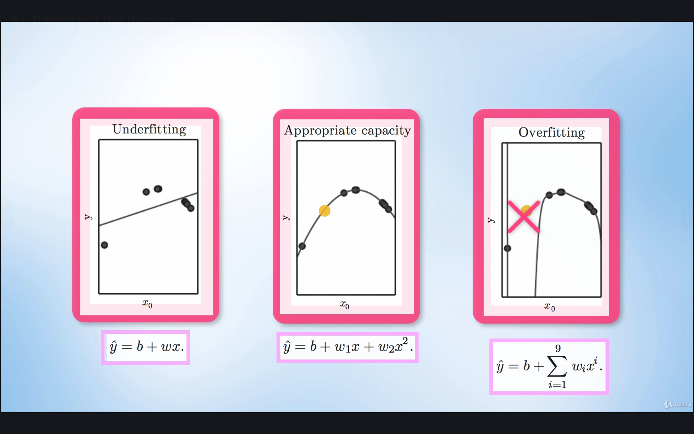

# Image Recognition

## Contents

* [The Dataset](#the-dataset)
* [The Network](#the-network)
* [The Training and Test Sets](#the-training-and-test-sets)
* [Underfitting](#underfitting)
* [Overfitting](#overfitting)
* [Notes on Implementing the Model](#notes-on-implementing-the-model)

## The Dataset

The MNIST dataset is essentialy a database of various handwritten digits.


<sub><i>Source: [Wikipedia](https://en.wikipedia.org/wiki/MNIST_database)</i></sub>

It is a multi-class dataset, consisting of 10 output classes, one class for each digit from 0 to 9.


<sub><i>Source: [PyTorch for Deep Learning and Computer Vision - Section 7: Image Recognition](https://github.com/rslim087a/PyTorch-for-Deep-Learning-and-Computer-Vision-Course-All-Codes-)</i></sub>

It contains both a training set and a validation/test set. It is commonly used to demonstrate the power of deep neural networks. It is available for download here <http://yann.lecun.com/exdb/mnist/> OR get it via [`torchvision.datasets`](https://pytorch.org/docs/stable/torchvision/datasets.html#mnist).

It is considered as the "*Hello World*" of machine learning because of its simplicity (compared to other datasets), and is usually used as an introduction to creating, training, and testing models.

## The Network

When using the MNIST dataset, the inputs to the network typically comes in the form of 28x28 images, which means a total of 784 pixels as inputs.


<sub><i>Source: [PyTorch for Deep Learning and Computer Vision - Section 7: Image Recognition](https://github.com/rslim087a/PyTorch-for-Deep-Learning-and-Computer-Vision-Course-All-Codes-)</i></sub>

Each pixel contains a random brightness value from 0(black) to 255(white).


<sub><i>Source: [PyTorch for Deep Learning and Computer Vision - Section 7: Image Recognition](https://github.com/rslim087a/PyTorch-for-Deep-Learning-and-Computer-Vision-Course-All-Codes-)</i></sub>

For a network to analyze these images, the network should look like the following:


<sub><i>Source: [PyTorch for Deep Learning and Computer Vision - Section 7: Image Recognition](https://github.com/rslim087a/PyTorch-for-Deep-Learning-and-Computer-Vision-Course-All-Codes-)</i></sub>

It will have an input layer containing 784 nodes.


<sub><i>Source: [PyTorch for Deep Learning and Computer Vision - Section 7: Image Recognition](https://github.com/rslim087a/PyTorch-for-Deep-Learning-and-Computer-Vision-Course-All-Codes-)</i></sub>

It will have a few hidden layers that feedforward the input values.


<sub><i>Source: [PyTorch for Deep Learning and Computer Vision - Section 7: Image Recognition](https://github.com/rslim087a/PyTorch-for-Deep-Learning-and-Computer-Vision-Course-All-Codes-)</i></sub>

It will have an output layer containing 10 nodes, 1 node for each of the numbers 0 to 9.


<sub><i>Source: [PyTorch for Deep Learning and Computer Vision - Section 7: Image Recognition](https://github.com/rslim087a/PyTorch-for-Deep-Learning-and-Computer-Vision-Course-All-Codes-)</i></sub>

The output node with the highest probability value indicates which handwritten number the network "sees".


<sub><i>Source: [PyTorch for Deep Learning and Computer Vision - Section 7: Image Recognition](https://github.com/rslim087a/PyTorch-for-Deep-Learning-and-Computer-Vision-Course-All-Codes-)</i></sub>

## The Training and Test Sets

Large datasets like the MNIST dataset are typically split into a **Training Set** and a **Test Set**.

The **Training Set** consists of inputs, where each input is correspondingly labeled to match the expected output (0 to 9). It is used to train the models.


<sub><i>Source: [PyTorch for Deep Learning and Computer Vision - Section 7: Image Recognition](https://github.com/rslim087a/PyTorch-for-Deep-Learning-and-Computer-Vision-Course-All-Codes-)</i></sub>

By continuously and iteratively updating the model's parameters using an optimization algorithm to minimize the error between the predicted and the expected labels, it will eventually be able to correctly classify the inputs from the **Training Set** with high accuracy.

But what happens when the model tries to classify input data it hasn't seen before (i.e. a test image)? It happens that it will misclassify this new, test image. Why does this happen? The model was trained to *memorize the pattern* of the **Training Set** instead of *generalizing the pattern* for other inputs that are not included in the **Training Set**.

When training classifiers, there is a problem that during training, the classifier naturally tries to *memorize the pattern* or the input-label correspondence. What it should do instead is to *understand the pattern*, to look for **general features** that differentiates the inputs from one another.

An analogy would be studying for a math exam. It would be pointless for us to memorize the solutions and answers to existing problem sets. Instead, we should aim to understand the approaches and theories behind the solutions, so that we can apply them to new problem sets.

This method of classifying new inputs that don't have labels is called **Generalization**. When training the model, we are aiming to minimize the training error. However, we should also aim to minimize the test error or the **generalization error**, using optimization techniques known as **Regularization**. We don't want a model that perfectly fits the given training data because that would be useless for real-world inputs.


<sub><i>Source: [PyTorch for Deep Learning and Computer Vision - Section 7: Image Recognition](https://github.com/rslim087a/PyTorch-for-Deep-Learning-and-Computer-Vision-Course-All-Codes-)</i></sub>


<sub><i>Source: [PyTorch for Deep Learning and Computer Vision - Section 7: Image Recognition](https://github.com/rslim087a/PyTorch-for-Deep-Learning-and-Computer-Vision-Course-All-Codes-)</i></sub>

Keep in mind that there comes a point during training that as we further minimize the training error, the test error increases. We want the training error to be small, but we also want the gap between the training error and the test error to be small as well.

That being said, the **Test Set** is made available for checking this test error or this **generalization error**. For this purpose, the **Test Set** is collected separately from the **Training Set**. This also helps in checking the performance of the model when deployed to the real-world.

## Underfitting

The challenge to getting to that optimally minimal training error is **Underfitting**, where the classifier hasn't completely memorized the pattern, but is not generalizing it enough to make somewhat accurate predictions. **Underfitting** happens when the model has not been provided sufficient capacity to analyze the data's underlying trend or pattern.


<sub><i>Source: [PyTorch for Deep Learning and Computer Vision - Section 7: Image Recognition](https://github.com/rslim087a/PyTorch-for-Deep-Learning-and-Computer-Vision-Course-All-Codes-)</i></sub>

## Overfitting

The challenge to keeping the gap between the training error and the test error small is **Overfitting**, where the classifier has completely memorized the pattern, so the training error is small but it can't generalize to accurately predict the new, test inputs.



<sub><i>Source: [PyTorch for Deep Learning and Computer Vision - Section 7: Image Recognition](https://github.com/rslim087a/PyTorch-for-Deep-Learning-and-Computer-Vision-Course-All-Codes-)</i></sub>

How would we fix **Overfitting**?

* Reduce depth and complexity of the network
    * The more hidden layers, the more specific will the classifier be in identifying features (ex. for the number "3", it might memorize specifically that the bottom pixels are all-white, instead of seeing the curved pattern of the bottom pixels)
* Reduce the number of nodes on each layer
* Reduce training epochs
* Use larger datasets
    * Using larger datasets can also help to reduce **Overfitting**, as the network must now be flexible enough to account for more data.
    * It doesn't always work, but training with more data *can* improve accuracy, so long as all the data is clean and relevant, and not just noisy data.

## Notes on Implementing the Model

For the final layer, don't use an activation function.

```python
def forward(self, x):
        res = F.relu(self._linear1(x))
        res = F.relu(self._linear2(res))
        res = self._linear3(res)  # <----- no ReLU here
```

When dealing with multi-class datasets, what we want to get are the raw outputs, known as the "scores":


<sub><i>Source: [PyTorch for Deep Learning and Computer Vision - Section 7: Image Recognition](https://github.com/rslim087a/PyTorch-for-Deep-Learning-and-Computer-Vision-Course-All-Codes-)</i></sub>

and not the probability values:


<sub><i>Source: [PyTorch for Deep Learning and Computer Vision - Section 7: Image Recognition](https://github.com/rslim087a/PyTorch-for-Deep-Learning-and-Computer-Vision-Course-All-Codes-)</i></sub>

The probability values, by nature of the activation functions, are either too close to 0 or too close to 1. We want to avoid continuously passing in values too close to 0 or 1 when iteratively training the model, since it's difficult to precisely represent these values with a float type without experiencing approximation flaws.

Instead, we use log probabilities such as [`nn.CrossEntropyLoss`](https://pytorch.org/docs/stable/nn.html#crossentropyloss). But we have to make sure that the output of the output layer is the raw output or the "scores".

Another thing, when the plot of the loss over the epochs appears like this:


<sub><i>Source: [PyTorch for Deep Learning and Computer Vision - Section 7: Image Recognition](https://github.com/rslim087a/PyTorch-for-Deep-Learning-and-Computer-Vision-Course-All-Codes-)</i></sub>

Then it is an indication to **decrease the learning rate**. That plot, where the losses are fluctuating irregularly (instead of always going down) means that the updates to the model parameters are too drastic over each epoch. This phenomenon is called **Divergent Losses** as the loss does not seem to be converging towards the minimum.

On the other hand, when the losses becomes "stuck" at a specific value and does not seem to go down anymore, then that is an indication to **increase the learning rate**. This means that the model got stuck at some local minimum loss (for a specific batch input) rather than the overall minimum (for all the inputs).

There are some systematic ways to find the optimal learning rate. But generally, start off with a high enough learning rate, then adjust downward.
