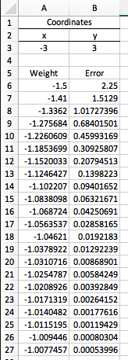

# Linear Regression

## Contents

* [Loss Function](#loss-function)
* [Gradient Descent](#gradient-descent)
* [Mean Squared Error](#mean-squared-error)

## Loss Function

The Loss Function is defined as:

> LOSS = (y1 - y0)2

where:
* y1 is the correct value
* y0 is current prediction value

The closer the prediction value is to the correct value, the smaller the loss or error.

We know that y0 = wx + b:

> LOSS = (y1 - (wx + b))2

The `b` here (the y-intercept, the point on the y-axis intersected by the line) indicates an infinite number of lines can be drawn that results in LOSS~0.

So, we can fix `b=0` to only consider the lines passing through the origin (`y=0`).

> LOSS = (y1 - wx)2

## Gradient Descent

From the initial line produced by the model (initialized with a random weight/slope **w** and bias/y-intercept **b**), we want it to move *towards* the direction where the loss/error function is approaching zero.

The trick is getting the gradient or the derivative of the loss function, which indicates the rate at which it changes. If rate of change is becoming vertical (i.e. towards +8 in the graph above), then it means the error rate is increasing. If the rate of change is becoming horizontal (i.e. towards 0) then the error rate is decreasing.

Given the loss function:

> LOSS = (y1 - (wx))2

Given the data point `y = 3` and `w = -3`:

> LOSS = (3 - (-3w))2

The derivative is:

> LOSS = (3 + 3w)2
>
> LOSS = 9 + 9w + 9w + 9w2
>
> LOSS = 9 + 18w + 9w2
>
> LOSS' = 18 + 18w
>
> LOSS' = 18(w + 1)

In summary, first compute the derivative of the loss function. Then substitute the current weight value of the line. That will give the current gradient value. Then, this current gradient value is subtracted from the current weight (w0) to get the new updated weight (w1):

> w1 = w0 - LOSS'

The new weight should result in a smaller error than the previous one. We keep doing this iteratively until we obtain a smallest error and the optimal parameters for the model to fit the date.

As we try to get the optimal gradient value, we need to iterate in very small steps, because we don't want it to move too drastically in one direction. To do that, we need to multiply **LOSS'** by a small value, called the **learning rate** **(&alpha;)**.

> w1 = w0 - &alpha; * LOSS'

See this sample visualization using Excel:

Basically, the gradient is like a compass, pointing us in the direction of the smallest error.

<i>Source: [LinearRegression-GradientDescentSimulation.xlsx](./LinearRegression/LinearRegression-GradientDescentSimulation.xlsx)</i>

### Mean Squared Error

The mean squared error is calculated the same way as the loss function, but this time, the bias value (i.e. the `b` or the y-intercept of the linear equation) will also be considered since it is also a parameter that needs to be optimized during training.

The formula for the Mean Squared Error is given by:

<i>Source: [yinyuWu/comp9417-machine-learning-and-data-mining](https://github.com/yinyuWu/comp9417-machine-learning-and-data-mining)</i>

The steps to calculate will not be shown here, but it is generally the same steps as with the **LOSS** function:

1. Substitute the (y = wx+b) formula for the current predicted value y0
1. Get the partial derivatives with respect to **w** and with respect to **b**
1. Get the current gradient value
1. Get the new weight by subtracting the current gradient value from the current weight
1. Iteratively repeat the previous steps until we get an error that approaches zero

> w1 = w0 - &alpha; * LOSS'
>
> b1 = b0 - &alpha; * LOSS'
