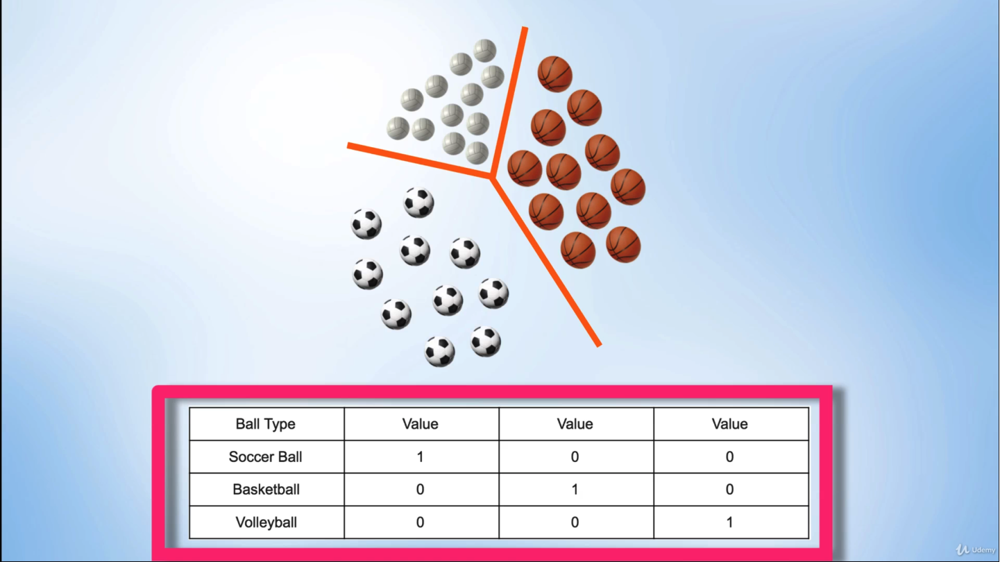

# One-Hot Encoding

Another thing to consider when shifting from binary to multi-class datasets is assigning labels to inputs, otherwise known as **label encoding**. With binary datasets, we can simply assign inputs to either 0 or 1. But for multi-class datasets, it does not make sense to assign 0 to N where N is the number of classes. For example, if we have 3 classes, assigning 0, 1, 2 could be confusing as it implies some sort of hierarchy, where class 2 is higher in order than class 1 or 0.

The solution to this is to use **One-Hot Encoding**.

<i>Source: [PyTorch for Deep Learning and Computer Vision - Section 15: Softmax](https://www.udemy.com/course/pytorch-for-deep-learning-and-computer-vision)</i>

For example:
* A soccer ball is classified as `100`
* A basketball is classified as `010`
* A volleyball is classified as `001`

This technique allows assigning linearly independent labels between classes, and does not imply any sort of magnitude order or hierarchy. Also, this can be extended to N classes by simply extending the number of columns.
