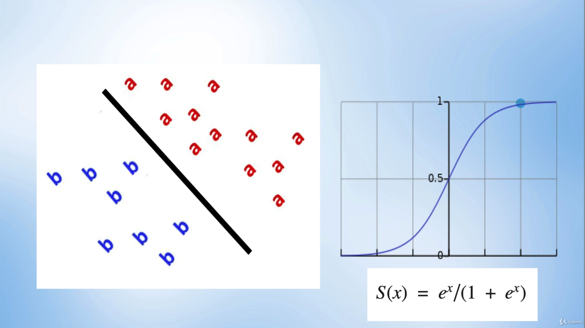
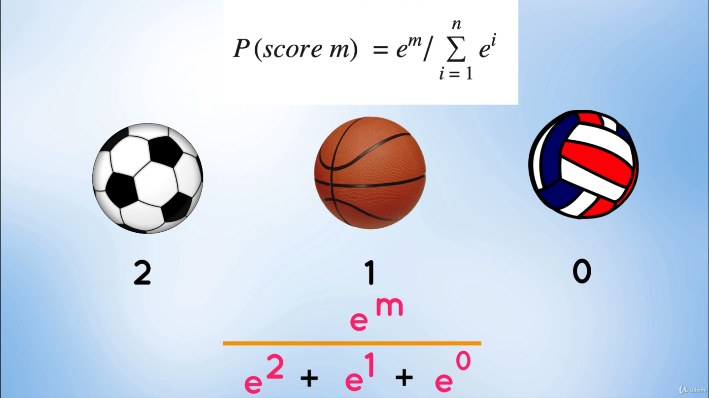
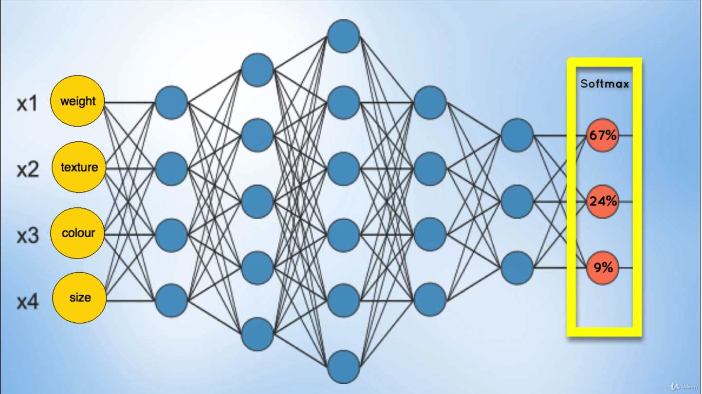

# Softmax

When dealing with binary datasets (2 output classes or labels), we used the **Sigmoid** activation function, which was rather effective for getting probability values between 0 and 1.

<i>Source: [PyTorch for Deep Learning and Computer Vision - Section 15: Softmax](https://www.udemy.com/course/pytorch-for-deep-learning-and-computer-vision)</i>

 But for multi-class datasets (3 or more output classes or labels, as shown in the image below), the binary nature of **Sigmoid** functions isn't applicable anymore, and it just makes classification difficult. For multi-class datasets, one typically uses the **Softmax** activation function instead.

<i>Source: [PyTorch for Deep Learning and Computer Vision - Section 15: Softmax](https://www.udemy.com/course/pytorch-for-deep-learning-and-computer-vision)</i>

The **Softmax** function still provides probability values, and ensures that:

1. The relative magnitude of each probability value is maintained (i.e. The probability of class 2 is higher than that of class 1, and the probability of class 1 is higher than that of class 0).
1. The summation of all probabilities is 1

<i>Source: [PyTorch for Deep Learning and Computer Vision - Section 15: Softmax](https://www.udemy.com/course/pytorch-for-deep-learning-and-computer-vision)</i>

> Softmax function calculates the probabilities distribution of the event over ‘n’ different events. In general way of saying, this function will calculate the probabilities of each target class over all possible target classes. Later the calculated probabilities will be helpful for determining the target class for the given inputs.
>
> The main advantage of using Softmax is the output probabilities range. The range will be 0 to 1, and the sum of all the probabilities will be equal to one. If the softmax function is used for multi-classification model, it returns the probabilities of each class and the target class will be the one with the highest probability.
