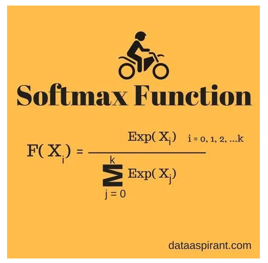

# Softmax

When dealing with binary datasets (i.e. data points on a cartesian coordinate system), we used the **Sigmoid** activation function, which was rather effective for getting probability values between 0 and 1.

For multi-class datasets, one typically uses the **Softmax** activation function instead of a **Sigmoid**.

<i>Source: [Difference Between Softmax Function and Sigmoid Function](https://dataaspirant.com/2017/03/07/difference-between-softmax-function-and-sigmoid-function/)</i>

> Softmax function calculates the probabilities distribution of the event over ‘n’ different events. In general way of saying, this function will calculate the probabilities of each target class over all possible target classes. Later the calculated probabilities will be helpful for determining the target class for the given inputs.
>
> The main advantage of using Softmax is the output probabilities range. The range will be 0 to 1, and the sum of all the probabilities will be equal to one. If the softmax function is used for multi-classification model, it returns the probabilities of each class and the target class will be the one with the highest probability.
