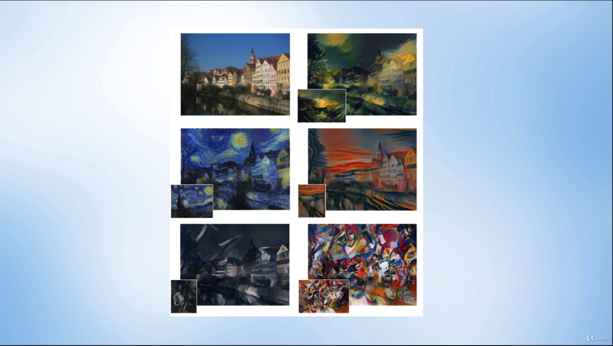
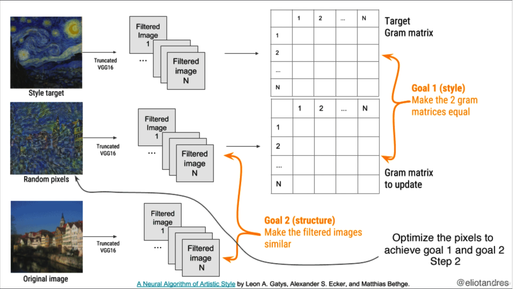

# Style Transfer

## Contents

* [What is Style Transfer?](#what-is-style-transfer)
* [How does it work?](#how-does-it-work)

## What is Style Transfer?

**Style Transfer** deals with the process of differentiating between **Image Content** and **Image Style**. **Image Content** relates to the objects in the image and their specific layout in the given image. **Image Style** refers basic components of the image, such as colors and texture, and can also include specific features, such as painting stroke styles.

The aim of **Style Transfer** is to combine the **Image Content** of one image with the **Image Style** of another image, effectively *transferring* the *style* of one image to another. The resulting image is called the **Target Image**.

In the following examples, different painting styles are applied to the original image on the top-left.

<i>Source: [PyTorch for Deep Learning and Computer Vision - Section 10: Transfer Learning](https://www.udemy.com/course/pytorch-for-deep-learning-and-computer-vision)</i>

For an in-depth technical background on Style Transfer, refer to the following whitepapers:

1. [Style Transfer using Convolutional Neural Networks](https://www.cv-foundation.org/openaccess/content_cvpr_2016/papers/Gatys_Image_Style_Transfer_CVPR_2016_paper.pdf)
1. [Texture Synthesis using Convolutional Neural Networks](https://papers.nips.cc/paper/5633-texture-synthesis-using-convolutional-neural-networks.pdf)

## How does it work?

First, wWe need a model that is already effective at feature extraction of images. Similar to [TransferLearning](./TransferLearning.md), we will need to take advantage of existing, sophisticated pre-trained models that have already been vigorously trained on huge, high-quality datasets and on powerful machines. We will then use the **Feature Extraction** section of that model.

Next, it should be possible to separate the contents and the styles of an image. This is done by prematurely getting the feature map outputs of specific layers of the model. We feed both the content image and the style image to the model, and extract the content image's content features and the style image's style features.

The objective then for the target image is to have content features that match the content image's features, and style features that match the style image's features.

The entire process is described in the [Style Transfer using Convolutional Neural Networks](https://www.cv-foundation.org/openaccess/content_cvpr_2016/papers/Gatys_Image_Style_Transfer_CVPR_2016_paper.pdf) whitepaper and is illustrated here:

<i>Source: [PyTorch for Deep Learning and Computer Vision - Section 10: Transfer Learning](https://www.udemy.com/course/pytorch-for-deep-learning-and-computer-vision)</i>
