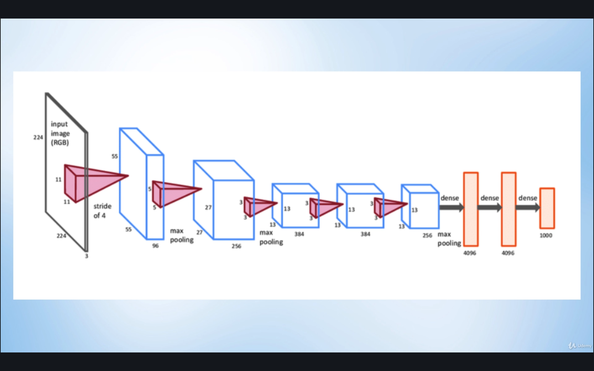
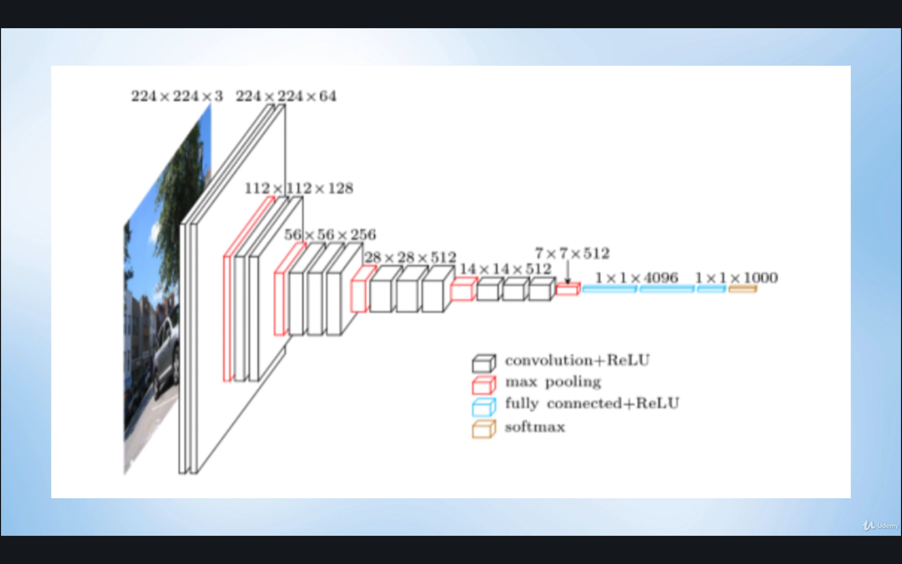
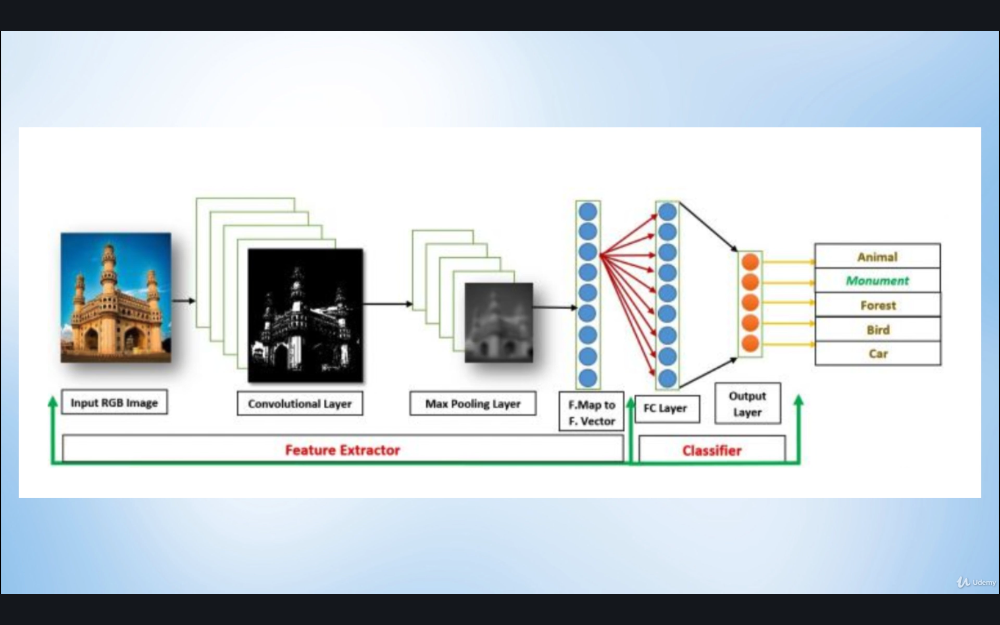

# Transfer Learning

## Contents

* [What is Transfer Learning?](#what-is-transfer-learning)
* [When do we use it?](#when-do-we-use-it)
* [How does it work?](#how-does-it-work)

## What is Transfer Learning?

Of the many factors that affect the performance of a model, two of the main ones are:

1. Model Architecture
1. Quality of Training

Both of these factors demand time costs, require *very* good data, and require computational power. Creating more complex architectures will require additional computational power to update all the parameters of the network, while improving the training is completely dependent on the size and quality of the dataset. Increasing both the complexity and the size of the dataset furthermore increases the training time.

Basically, getting good accuracy for complex datasets can be very resource-intensive. So while creating and training your own neural network model is a rewarding and necessary step in a Machine Learning project, there are specific situations where we are limited by time, data, or computational power. In these cases, we can take advantage of existing pre-trained models. This is known as **Transfer Learning**.

**Transfer Learning** is when you take the knowledge obtained from the completion of one task, and apply it to another, **related** task that needs to be achieved. As an analogy, it's like when learning a new programming language: you can take the concepts, skills, methods from a previously mastered programming language, and use it to learn a new one. Learning a second, third, or nth programming language becomes easier/faster as compared to when you learned your very first programming language.

This concept can be applied to machine learning models. Suppose you developed a model that can already accurately classify cars in a parking area during the daytime. Now, say you want to make a model that can also classify cars in the same parking area but this time during the nighttime. Do we start from scratch by gathering new images of cars and training a new model? With transfer learning, we can take the model that can already classify cars, and then make minor adjustments to help it also recognize cars from nighttime images. This will save a lot of time as the model already "knows" what a car looks like, and we just need it to "learn" what a car looks like at night.

## When do we use it?

1. When there isn't enough new labelled data to train the model from scratch
1. When there isn't enough time or computational power to train a new model from scratch
1. When there already exists a pre-trained model that is already effective at doing the same task that you want to accomplish

## How does it work?

Let's take two existing pre-trained models.

Here is the architecture of the **Alexnet** model:

<i>Source: [PyTorch for Deep Learning and Computer Vision - Section 10: Transfer Learning](https://www.udemy.com/course/pytorch-for-deep-learning-and-computer-vision)</i>

Here is the architecture of the **VGG16** model:

<i>Source: [PyTorch for Deep Learning and Computer Vision - Section 10: Transfer Learning](https://www.udemy.com/course/pytorch-for-deep-learning-and-computer-vision)</i>

Both models take a 224x224 3-channel input image, which is much *much* larger than the 28x28 input used for the [MNIST dataset](../src/ConvolutionalNeuralNetworks-MNIST.ipynb) or the 32x32 input used for the [CIFAR 10 dataset](../src/ConvolutionalNeuralNetworks-CIFAR10.ipynb).

Both models would also require much *much* greater computational power than the models used to classify the [MNIST dataset](../src/ConvolutionalNeuralNetworks-MNIST.ipynb) or [CIFAR 10 dataset](../src/ConvolutionalNeuralNetworks-CIFAR10.ipynb) (which was roughly ~10minutes on GPU).

Both models also used the [ImageNet](http://www.image-net.org/) dataset, which consists of **14 million images** and **20 thousand** categories or "synonym sets" (or "synsets") to serve as labels for the images.

If we were able to use this AlexNet or VGG16 models to classify similar datasets, it would be an efficient strategy.

These models are available in PyTorch as part of the [`torchvision.models`](https://pytorch.org/docs/stable/torchvision/models.html) module, along with other popular models for classification, semantic segmentation, object detection, and video classification.

The procedure for reusing existing models is as follows.

<i>Source: [PyTorch for Deep Learning and Computer Vision - Section 10: Transfer Learning](https://www.udemy.com/course/pytorch-for-deep-learning-and-computer-vision)</i>

Convolutional Neural Networks is mainly composed of 2 sections: the **Feature Extractor** section (the convolutional layers + max pooling layers) and the **Classifier** section (the fully-connected layers).

We are first going to freeze the parameters of the **Feature Extractor** portion of the network. This means the convolutional layers will be unaffected by training and we use the same feature extraction "skills" without tampering or adjusting them. It is important to note the earlier consideration that this will only work if the existing pre-trained network is to be used for another *similar* application. For example, we can reuse AlexNet or VGG16 to classify our own specific dataset, ex. some specific species of ants and bees, knowing that ants and bees are already part of the ImageNet dataset.

Next, we make the **Classifer** section dynamic, since we want it to learn which specific features are important to classify our own specific dataset, ex. which are ants and which are bees. So only the parameters of the fully-connected layers will change, as it adapts to our own specific dataset. It is important to note here that our own dataset *does not need to be the same size* as the original datasets the model has been trained on. Remember that the pre-trained models already "knows" what ants and bees are, we are just giving it a little more details specific to our application.

Lastly, the pre-trained models have 1000 classes at their output layers. Since we only need 2 classifications (ants or bees) for our datasets, we will need to add another layer at the end, so that the model's output is reduced to 2 classes.

So while we still have to do some training, it is going to be much faster and less resource intensive as compared to creating the model from scratch.
