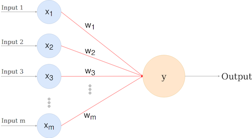
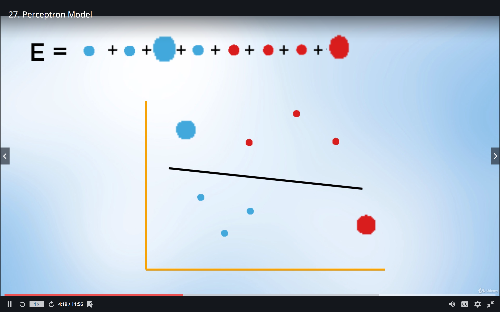
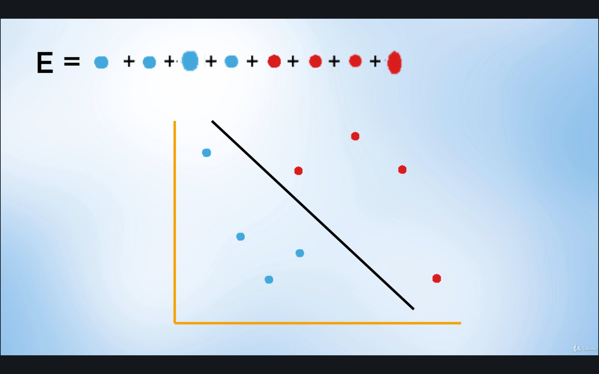
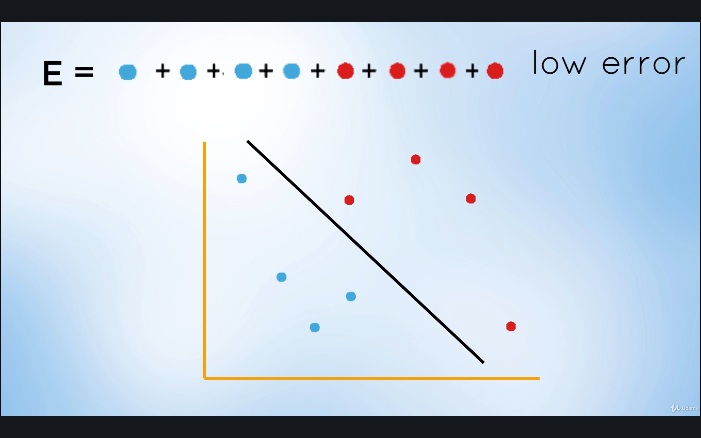
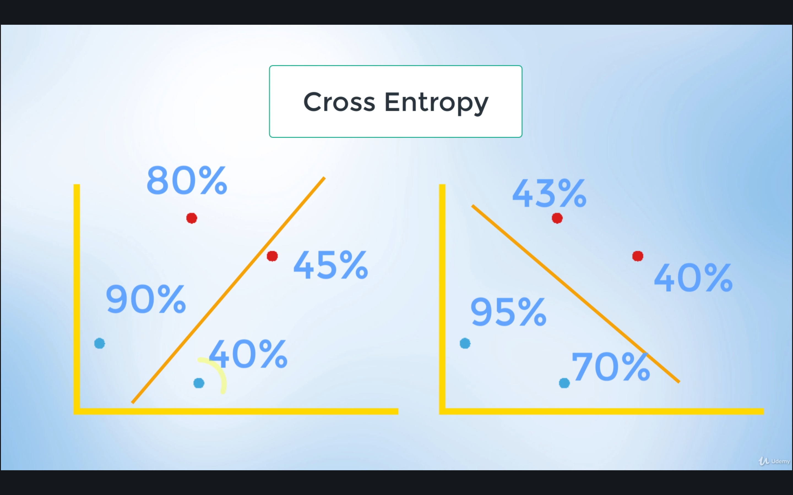
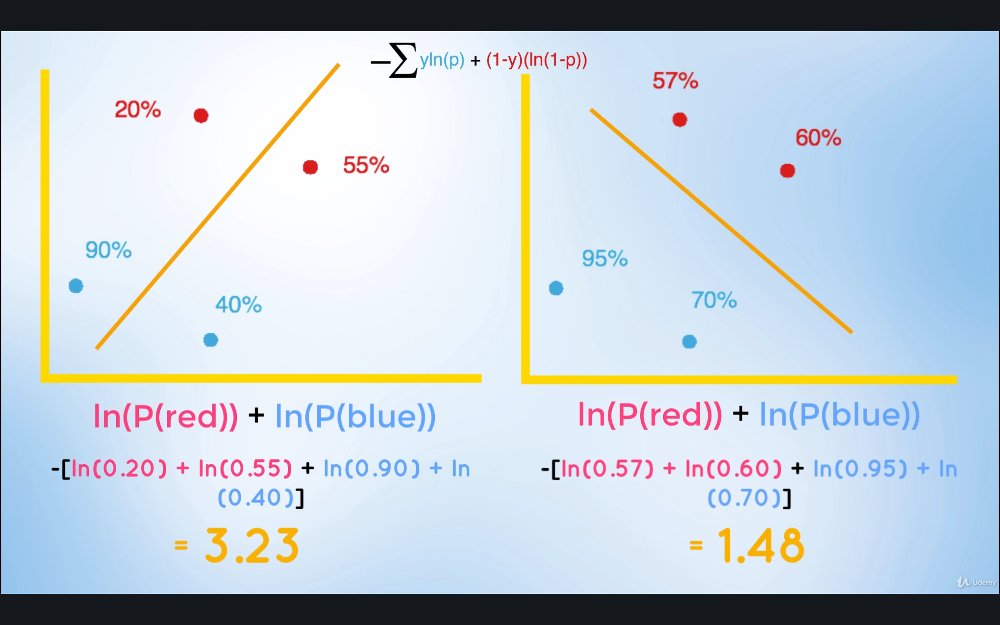
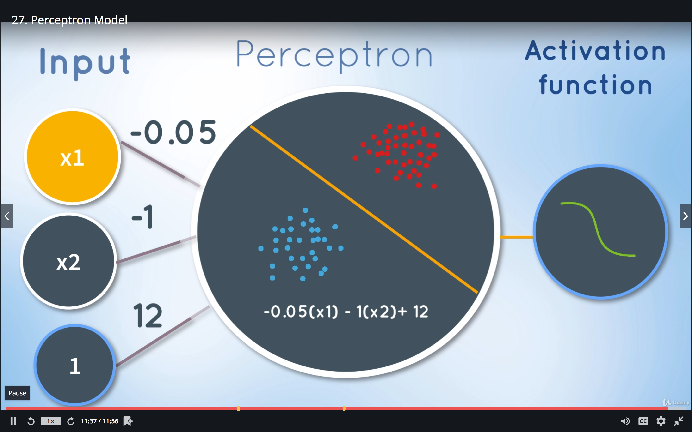
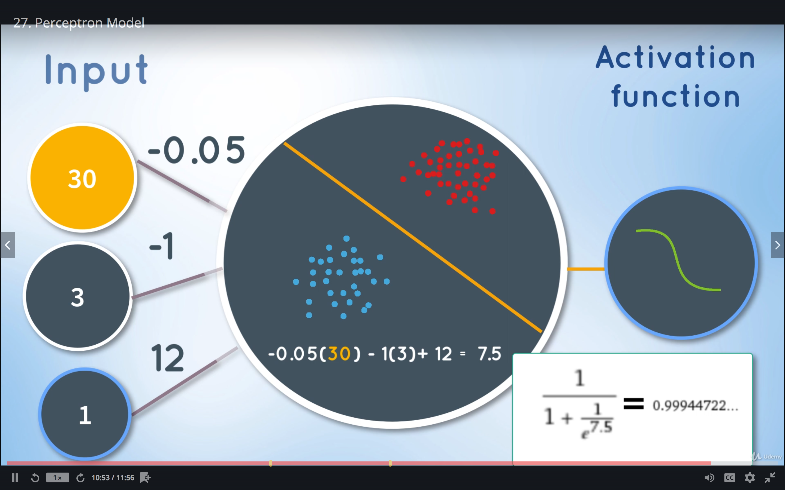
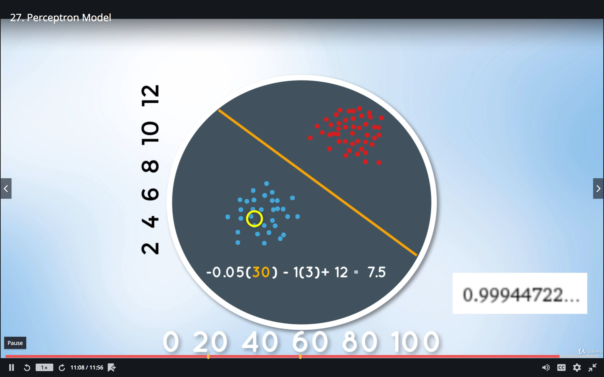
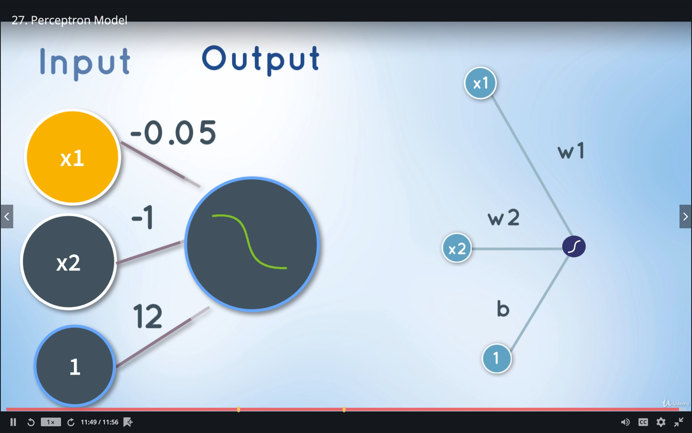

# Data Structures

* [Perceptron](#perceptron)
    * [Assigning Errors](#assigning-errors)
    * [Assigning Probabilities](#assigning-probabilities-cross-entropy)
    * [Creating the Model](#creating-the-model)

## Perceptron

Source: [The Perceptron](https://towardsdatascience.com/the-perceptron-3af34c84838c)

### Assigning Errors

The deviation of each prediction from the correct values are assigned penalty values. The total error is basically the sum of all the errors of each predicted value.

At the start, the model will produce a high error. Then, by continuously adjusting the parameters of the model using **Gradient Descent**, the error decreases until we get to a low error model.

### Assigning Probabilities (Cross Entropy)

We can also look at it in terms of probabilities.

The closer-to-1 probabilities mean that this point is likely to be in the positive region, while closer-to-0 probabilities mean that this point is likely to be in the negative region.

In the left model, the 40% blue point is saying that it is likely to be in the negative region (which is wrong) and the 80% red point is saying that it is likely to be in the positive region (which is also wrong). This model is said to have a high error.

In the right model, all probabilities correctly specify whether a point belongs to a positive or a negative region. This model is said to have a low error.

The equation for the summation of these probabilities is given above, and it shows what was just explained, that the left model has a high error and the right model has a low error.

This is known as **Cross Entropy**, which measures the performance of a classification model whose output is a probability value between 0 and 1.

### Creating the Model

The model can be represented with the following diagram.

The trained model is basically represented by the linear equation

> y = mx + b

where `m` is found out to be `-0.05` and `b` is `12`.

> y = -0.05(x) + 12

Then, moving `y` to the other side

> 0 = -0.05(x) - 1(y) + 12

Then, replacing variables

> 0 = -0.05(x1) - 1(x2) + 12

We now get the equation for our model that can predict a point value given 2 input parameters x1 and x2.

To convert the output to a probability, we pass it to an **Activation Function** called a **Sigmoid** function.

For example, if x1=30 and x2=3, then the output would be

which means that for the given input, there is a 99.94% probability that it is in the positive region (blue dots). This makes sense, because if the same inputs were plotted using the linear equation

the resulting point will indeed be plotted in the positive region.

Once we have an accurate model, we can now use it to make predictions from inputs even without knowing the labels for each.

This is known as the **Perceptron** model.

